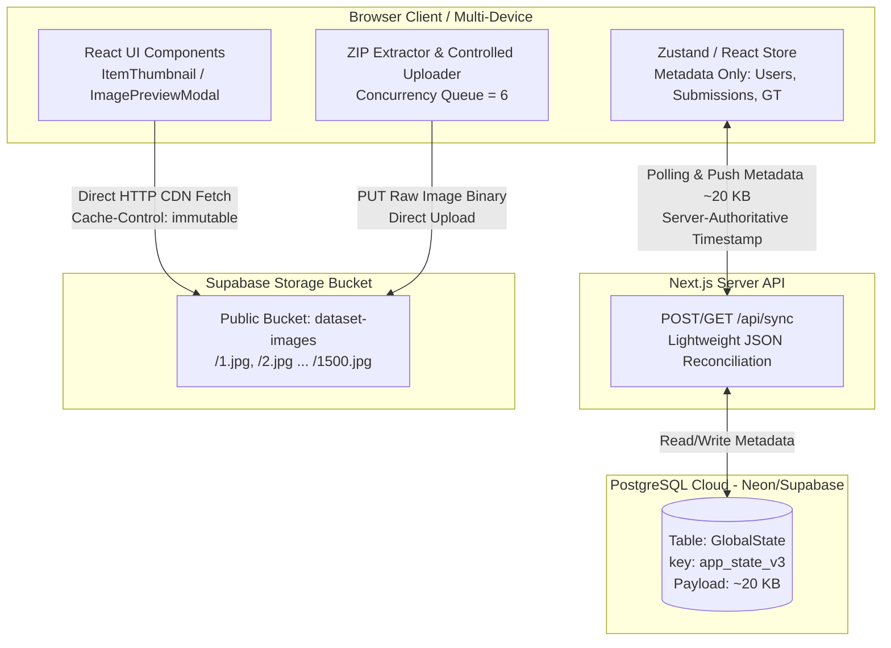

# ARCHITECTURE REVIEW & SYSTEMATIC MIGRATION PLAN
**Transitioning from Relational Base64 Blob Storage to Decoupled Cloud Object Storage (Supabase Storage + Neon PostgreSQL)**

---

## 1. EXECUTIVE SUMMARY & ARCHITECTURE REVIEW

### 1.1 Objective Assessment of the Proposed Architecture
Rencana Anda untuk **memisahkan penyimpanan aset statis gambar (Object Storage - Supabase Storage)** dari **penyimpanan data transaksional/metadata (Relational Database - Neon PostgreSQL)** adalah **KEPUTUSAN ARSITEKTURAL YANG 100% TEPAT DAN SEJALAN DENGAN BEST PRACTICE ENTERPRISE**.

Menyimpan data gambar berekstensi biner dalam format `base64` di dalam kolom teks database relasional (PostgreSQL) adalah *anti-pattern* klasik yang menyebabkan kegagalan sistem pada skala produksi karena empat alasan teknis fundamental:
1. **TOAST Bloat & I/O Thrashing:** PostgreSQL menyimpan kolom teks berukuran besar (>2 KB) dalam struktur *The Oversized-Attribute Storage Technique* (TOAST). Ketika tabel `GlobalState` diakses untuk membaca atau menyinkronkan metadata, engine database dipaksa membaca halaman disk TOAST berukuran puluhan megabita, menyebabkan *buffer cache eviction* dan CPU spike.
2. **Base64 Payload Inflation:** Encoding base64 memperbesar ukuran file asli sebesar **~33%**. File ZIP berukuran 100 MB berubah menjadi ~135 MB string teks yang membebani memori server Node.js dan jaringan.
3. **Exhaustion of Egress / Bandwidth Quota:** Layanan database cloud gratis maupun berbayar (seperti Neon.tech) memiliki batas kuota transfer data bulanan (*egress bandwidth limit*). Mengirimkan puluhan megabita gambar berulang kali saat rekonsiliasi antar-device menghabiskan kuota 5 GB dalam waktu singkat.
4. **Hilangnya Kemampuan Caching HTTP Native:** Database tidak memiliki protokol caching HTTP (seperti `ETag`, `Last-Modified`, atau `Cache-Control`). Sebaliknya, Object Storage/CDN dirancang khusus agar browser dapat menyimpan aset statis di *HTTP Disk Cache* secara permanen.

---

### 1.2 Tinjauan Kritis & Penyempurnaan Rencana (Objective Architectural Critique)
Sebagai Principal Architect, saya mengidentifikasi **4 poin krusial** yang harus disempurnakan dari rencana awal Anda agar migrasi ini benar-benar optimal, aman, dan efisien:

#### KRITIK 1: Jangan Simpan URL Absolut Gambar di PostgreSQL
*   **Risiko Rencana Konvensional:** Banyak developer menyimpan URL lengkap (`https://abc.supabase.co/storage/v1/object/public/dataset/1.jpg`) ke dalam kolom database untuk setiap item dataset.
*   **Best Practice:** **Gunakan Deterministic URL Resolution.**
    *   Karena dataset menggunakan penomoran ID unik (`id: 1, 2, ..., 1500`), database **sama sekali tidak perlu menyimpan path atau URL gambar**.
    *   Database cukup menyimpan `id: 1`. Di frontend, URL dibangun secara deterministik via *pure helper function*:
        ```typescript
        export const getDatasetImageUrl = (id: number): string =>
          `${process.env.NEXT_PUBLIC_SUPABASE_STORAGE_URL}/${id}.jpg`;
        ```
    *   *Keuntungan:* Menghemat storage database 100%, menghilangkan redundansi data, dan memungkinkan perpindahan provider storage (misal ke AWS S3 atau Cloudflare R2) kelak hanya dengan mengganti 1 variabel lingkungan (`ENV`).

#### KRITIK 2: Eliminasi Total Caching Base64 di IndexedDB & React State (`imageMap`)
*   **Risiko Rencana Konvensional:** Mempertahankan state `imageMap: Record<number, string>` di memori React dan IndexedDB yang kini diisi URL Supabase.
*   **Best Practice:** **Biarkan Browser Native HTTP Cache yang Bekerja.**
    *   Object Storage Supabase mengembalikan *header response*:
        `Cache-Control: public, max-age=31536000, immutable`
    *   Ketika komponen `` dirender, browser secara otomatis menyimpan gambar tersebut di **Browser HTTP Disk Cache**.
    *   *Keuntungan:* Kita dapat **menghapus seluruh kompleksitas manajemen `imageMap`, `fetchImageById`, dan sinkronisasi gambar antar-device di `store.tsx`**. RAM browser hemat ratusan megabita, tidak ada lagi risiko *re-render loop*, dan gambar langsung terbuka instan di semua device tanpa perlu proses sinkronisasi manual.

#### KRITIK 3: Manajemen Concurrency Saat Upload File ZIP (Client-Side Ingestion)
*   **Risiko Rencana Konvensional:** Saat pengguna mengunggah file ZIP 100 MB berisi 1.500 gambar, mengekstrak dan mengirimkan 1.500 request `PUT/POST` sekaligus ke Supabase Storage akan memicu *CORS Rate Limit*, *Browser Connection Pool Starvation* (maksimal 6 koneksi simultan per domain), atau *Network Timeout*.
*   **Best Practice:** **Implementasikan Throttled Worker Pool / Controlled Concurrency Queue.**
    *   Ekstraksi ZIP dilakukan secara lokal di browser, kemudian file diunggah ke Supabase Storage menggunakan antrean dengan *concurrency limit* = 6–8 *parallel requests*.
    *   Frontend menampilkan *progress bar* real-time (`450 / 1500 gambar berhasil diunggah (30%)`).

#### KRITIK 4: Solusi Masalah Kuota Neon yang Sudah Habis
*   **Kondisi Saat Ini:** *Your project has exceeded the data transfer quota* pada instance Neon lama.
*   **Rekomendasi Strategis:**
    *   Karena kuota transfer instance Neon lama sudah habis, Anda perlu **membuat Project Neon baru** (atau mereset instance lama) khusus untuk arsitektur baru.
    *   *Alternatif (Sangat Direkomendasikan):* Karena Anda akan membuat project di **Supabase** untuk Storage Bucket, Anda juga dapat **menggunakan Database PostgreSQL gratis dari Supabase sekaligus** sebagai pengganti Neon agar Database & Storage berada dalam 1 platform/dashboard terintegrasi. (Namun tetap menggunakan Neon baru pun sepenuhnya kompatibel).

---

## 2. KOMPONEN YANG DIPERTAHANKAN VS DIGANTI

| Komponen Sistem | Status | Tindakan & Perubahan Arsitektur |
| :--- | :---: | :--- |
| **Prisma ORM (`prisma/schema.prisma`)** | **DIPERTAHANKAN** | Model `GlobalState` tetap dipertahankan. Hanya menyimpan metadata transaksional (`app_state_v3`). |
| **Endpoint `/api/sync`** | **DIPERTAHANKAN & DIPERTAS** | Tetap menjadi *single source of truth* untuk sinkronisasi metadata (`users`, `submissions`, `dataset`, `gtHistory`, `activityLogs`). Payload menjadi sangat ringan (~15–25 KB). |
| **Endpoint `/api/images`** | **DIGANTI / DIHAPUS** | Endpoint `/api/images` untuk *read/write base64* ke database **dihapus/dinonaktifkan total**. Gambar tidak lagi melewati server Next.js maupun PostgreSQL. |
| **Penyimpanan Gambar Base64 di PostgreSQL** | **DIHAPUS TOTAL** | Seluruh baris `key: "img_*"` dan `key: "imageMap"` dihapus dari database. |
| **Penyimpanan Gambar Baru** | **BARU (SUPABASE STORAGE)** | Menggunakan **Supabase Object Storage Bucket** (`dataset-images`) dengan akses *Public Read*. |
| **State React (`imageMap` di `store.tsx`)** | **DISEDERHANAKAN / DIHAPUS** | Menghapus state `imageMap` berukuran raksasa. Komponen UI langsung merender URL deterministik Supabase. |
| **IndexedDB Image Storage (`imageStorage.ts`)** | **DIHAPUS / DEPRECATED** | Digantikan sepenuhnya oleh **Browser Native HTTP Disk Cache**. |
| **Komponen Preview (`ItemThumbnail`, `ImagePreviewModal`)** | **DIPERTAHANKAN (REFACTOR RINGAN)** | Atribut `src` diubah dari membaca `imageMap[id]` menjadi fungsi `getDatasetImageUrl(id)`. |

---

## 3. ANALISIS DAMPAK ARSITEKTURAL (IMPACT ANALYSIS)



1.  **Dampak terhadap PostgreSQL & Prisma:**
    *   I/O database turun drastis hingga **99,8%**.
    *   Ukuran database stabil di bawah **5 MB** selamanya.
    *   Tidak ada lagi risiko kuota transfer bulanan habis.
2.  **Dampak terhadap Sinkronisasi Multi-Device:**
    *   Sinkronisasi state antar-device berlangsung **instan (<100 ms)** karena payload `/api/sync` hanya berisi JSON metadata murni (~20 KB).
    *   Device baru yang membuka aplikasi langsung dapat melihat preview gambar secara otomatis dari Supabase CDN tanpa perlu mengunduh puluhan megabita data ke IndexedDB terlebih dahulu.
3.  **Dampak terhadap Performa Frontend:**
    *   Waktu muat awal (*First Contentful Paint & Time to Interactive*) meningkat signifikan karena memori utama JavaScript tidak dibebani puluhan megabita string base64.

---

## 4. PERSIAPAN PRASYARAT (PREREQUISITES CHECKLIST)

Sebelum eksekusi implementasi kode dimulai, Anda perlu melakukan persiapan infrastruktur berikut:

- [ ] **1. Persiapan Database PostgreSQL Baru (Mengatasi Kuota Habis):**
    *   *Opsi A:* Buat Project baru di Neon.tech agar mendapatkan kuota *bandwidth transfer* segar.
    *   *Opsi B (Rekomendasi):* Gunakan database PostgreSQL gratis yang langsung disertakan saat Anda membuat Project di Supabase.
- [ ] **2. Pembuatan Project & Storage Bucket Supabase:**
    *   Buat project baru di dasbor [Supabase.com](https://supabase.com).
    *   Buka menu **Storage** $\rightarrow$ Buat Bucket baru bernama: `dataset-images`.
    *   Atur status Bucket menjadi **Public Bucket** (agar gambar dapat dibaca oleh browser tanpa token autentikasi rumit).
    *   Konfigurasikan **Storage Policy (RLS)**:
        *   *SELECT (READ):* Allow public access (`true`).
        *   *INSERT/UPDATE/DELETE (WRITE):* Allow public upload atau gunakan Anon Key / Service Role Key untuk proses upload dataset.
- [ ] **3. Konfigurasi Environment Variables (`.env.local` & Vercel Dashboard):**
    *   `DATABASE_URL`: Connection string PostgreSQL baru.
    *   `NEXT_PUBLIC_SUPABASE_URL`: URL project Supabase (`https://<project-id>.supabase.co`).
    *   `NEXT_PUBLIC_SUPABASE_ANON_KEY`: Kunci publik Supabase untuk otorisasi upload langsung dari browser (jika menggunakan client storage).
    *   `NEXT_PUBLIC_STORAGE_BASE_URL`: URL dasar publik bucket (`https://<project-id>.supabase.co/storage/v1/object/public/dataset-images`).
- [ ] **4. Konfigurasi Domain Gambar di `next.config.ts` (Opsional jika migrasi ke `<Image />`):**
    *   Tambahkan domain `*.supabase.co` pada `images.remotePatterns` agar kompatibel dengan perenderan gambar Next.js.

---

## 5. STRATEGI MIGRASI SECARA BERURUTAN (STEP-BY-STEP MIGRATION PLAN)

Migrasi dirancang dengan prinsip **Zero Data Loss & Safe Incremental Transition**:

```
[TAHAP 1: Infrastructure Setup] 
       │
       ▼
[TAHAP 2: Helper Resolution & Storage Layer Integration]
       │
       ▼
[TAHAP 3: Refactor Upload ZIP (Upload Binary ke Supabase Storage)]
       │
       ▼
[TAHAP 4: Refactor UI Rendering (Direct URL Fetch)]
       │
       ▼
[TAHAP 5: Cleanup & Deprecation (/api/images & Base64 Database Clean)]
```

### Tahap 1: Setup Lingkungan & Koneksi
*   Memasukkan variabel lingkungan Supabase (`NEXT_PUBLIC_SUPABASE_URL`, `NEXT_PUBLIC_STORAGE_BASE_URL`).
*   Memperbarui `DATABASE_URL` ke instance database yang memiliki kuota bersih.

### Tahap 2: Pembuatan Helper Deterministic Image URL
*   Membuat utilitas baru `src/lib/imageUrl.ts`:
    *   Fungsi `getDatasetImageUrl(id: number): string` yang menghasilkan URL absolut Supabase Storage.
    *   Fungsi validasi *fallback* apabila gambar belum tersedia.

### Tahap 3: Refactor Alur Upload Dataset ZIP (`uploadTestZip`)
*   Mengubah logika di `src/lib/store.tsx` (`uploadTestZip`):
    *   Saat file ZIP diekstrak, file biner gambar dikirim langsung ke **Supabase Storage Bucket (`dataset-images`)** menggunakan *controlled queue* (maksimal 6 upload simultan).
    *   Metadata ID gambar (`1..1500`) dan label GT diperbarui ke dalam state `dataset` dan dikirim ke `/api/sync` (PostgreSQL).
    *   Menghapus pengiriman payload base64 ke `/api/images`.

### Tahap 4: Refactor Komponen UI Preview Gambar
*   Mengubah komponen `src/components/ui/ItemThumbnail.tsx` dan `src/components/ui/ImagePreviewModal.tsx`:
    *   Mengganti pembacaan `imageMap[id]` menjadi panggilan langsung `getDatasetImageUrl(id)`.
    *   Menambahkan penanganan *image error loading* (*fallback state*) jika gambar gagal dimuat dari CDN.

### Tahap 5: Pembersihan State & Pemangkasan Kode Lama (Cleanup)
*   Menghapus endpoint lama `/api/images/route.ts` atau mengubahnya menjadi *health check*.
*   Menghapus ketergantungan `imageMap` dari `store.tsx` dan menonaktifkan sinkronisasi base64 dari IndexedDB (`src/lib/imageStorage.ts`).

---

## 6. MANAJEMEN RISIKO & STRATEGI ROLLBACK (RISK MATRIX & ROLLBACK PLAN)

| Potensi Risiko | Tingkat Dampak | Mitigasi Pencegahan | Strategi Rollback Jika Terjadi Kegagalan |
| :--- | :---: | :--- | :--- |
| **CORS / Rate Limit saat Upload ZIP 1.500 Gambar** | Sedang | Menggunakan mekanisme antrean *throttling* (*batch limit* = 6 request simultan) dengan waktu jeda (*backoff retry*). | Pengguna dapat mengunggah ulang ZIP tanpa menduplikasi metadata karena nama file bersifat *idempotent* (`${id}.jpg`). |
| **Keterlambatan Propagasi CDN / Cache Stale** | Rendah | Menggunakan nama file konstan berbasis ID unik (`1.jpg`). File dataset bersifat statis (tidak ditimpa/berubah). | Cache browser dapat di-refresh secara paksa dengan penambahan *version query parameter* (`${url}?v=${version}`). |
| **Kegagalan Koneksi Supabase Storage** | Rendah | Menggunakan *retry logic* otomatis 3x pada *client uploader*. | Mempertahankan *snapshot backup* metadata JSON `app_state_v3` di file lokal. |

---

## 7. DAFTAR PEKERJAAN IMPLEMENTASI (WORK BREAKDOWN STRUCTURE - WBS)
*(Akan dikerjakan secara bertahap pada fase implementasi berikutnya setelah dokumen ini disetujui)*

1.  **[INFRA]** Konfigurasi `.env.local` dengan kredensial Supabase Storage & Database bersih.
2.  **[CORE]** Pembuatan modul `src/lib/imageUrl.ts` (Deterministic URL Resolver).
3.  **[CORE]** Pembuatan modul `src/lib/supabaseStorage.ts` (Client-side Controlled Batch Uploader untuk file ZIP).
4.  **[STORE]** Refactor `src/lib/store.tsx`:
    *   Mengganti alur `uploadTestZip` agar mengunggah biner gambar ke Supabase Storage.
    *   Menghapus logika polling `/api/images?checkIds=1`.
    *   Menghapus dependensi `imageMap` dan sinkronisasi base64.
5.  **[UI]** Refactor `src/components/ui/ItemThumbnail.tsx` & `ImagePreviewModal.tsx` agar menggunakan URL Supabase langsung.
6.  **[API]** Pembersihan/penghapusan endpoint `/api/images/route.ts`.
7.  **[VERIFY]** Audit pembersihan kode & validasi kompilasi (`npm run lint` & `npm run build`).
